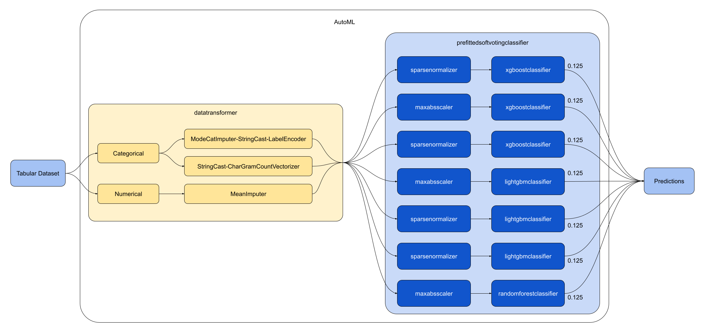
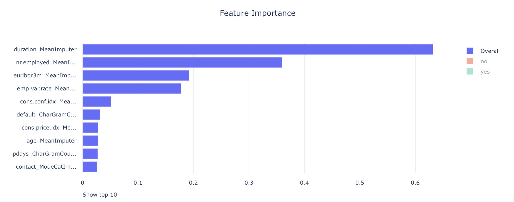

# Optimizing an ML Pipeline in Azure

### Author: Lucas Oliveira

## Table of Contents
1. [Overview](#overview)
2. [Summary](#summary)
3. [Scikit-learn Pipeline](#scikit-learn-pipeline)
4. [AutoML](#automl)
5. [Pipeline comparison](#pipeline-comparison)
6. [Future work](#future-work)
7. [References](#references)

## Overview
This project is part of the Udacity Azure ML Nanodegree.
In this project, we build and optimize an Azure ML pipeline using the Python SDK and a provided Scikit-learn model.
This model is then compared to an Azure AutoML run.

## Summary

The data is about direct marketing campaigns of a Portuguese banking institution [1]. This dataset contains 21 features with different informations from bank clients, like **age**, **job**, **marital status**, **education**, and also information about their contact with the bank campaign and social/economic attributes. It also has a **y** variable indicating whether or not the client the client subscribed a term deposit. The total dataset contains 32950 entries. The distribution of the **y** variable is unbalanced, skewed towards the **no** value. The total occurrences of **no** values are 29258 (88.8%), whereas the total occurrences of **yes** values are 3692 (11.2%).[1]

Our classification goal is to use the features of a client to predict if he or she will subscribe (yes/no) a term deposit (variable y) [1].

The best performing model was a VotingEnsemble, which achieved an accuracy of **0.9170**.

## Scikit-learn Pipeline
The first model trained was a logistic regression model. In the image below we illustrate the pipeline used for training:

It first loads the dataset, clean it and then feed into the model for training. The model run several iterations driven by Azure Hyperdrive in order to find the hyperparameters that maximize the model's accuracy.

The hyperparameters tuned were the **Inverse of regularization strength** and the **Maximum number of iterations to converge**. 

The parameter sampler used was the random sampling. In random sampling, hyperparameter values are randomly selected from the defined search space [2]. The advantages of using random sampling are that it supports discrete and continuous hyperparameters [2] and also can cover a broad range of hyperparameters values in a short period of time. Some users do an initial search with random sampling and then refine the search space to improve results [2].

An early stopping policy help save time and computer processing since it will prevent the experiment to stay trying to optimize runs with hyperparameters that doesn't seem promising to get good results. In the experiment The early stopping policy chosen was the bandit policy. Bandit policy is based on slack factor/slack amount and evaluation interval. Bandit ends runs when the primary metric isn't within the specified slack factor/slack amount of the most successful run [3]. A bandit policy provides more agressive savings, that is, it tends to stop an experiment earlier than other policies, like Median Stopping Policy [4]. This tends to help the experiment to check more alternatives of hyperparameters faster, however it also may discard promising features if they do not show good performance in a short amount of iterations.

The final accuracy result of this experiment using a Logistic Regression model was **0.9139**.

## AutoML
The second architecture was setup using Azure AutoML. The AutoML conducted a model and hyperparameters search trying maximize the model's accuracy. 

After 25 iterations, the best model found was a VotingEnsemble composed of 7 classifiers. Each one of these classifier have a weight of 0.125 in the final prediction. See below the best model architecture:

Azure AutoML also generated a feature importance graph:

From the graph we can see that the two most important features for the classification were the **duration** and **nr.employed**, both after passing through the MeanImputer function from the data transformation step.

Here it justs loads the data and give it to the AutoML search for models and hyperparameters that maximize the model's accuracy.

The final accuracy result of the VotingEnsemble model found by AutoML was **0.9170**.

## Pipeline comparison
The accuracy of the two models were very similar, with a small advantage to the model found using Azure AutoML. Although the performance gain was small, the model found by AutoML was much bigger, being composed of seven different classifiers. Despite that, the process of using AutoML was much simpler since it did not required us to clean the data, choose a model and select search parameters. AutoML does all of this automatically giving a very similar result, however this come with the cost of more computing time.

## Future work
In order to improve our model search we can do a few things:
- Let AutoML and Hyperdrive run for longer period of times so they can search for better models that did not have the oportunity to be checked;
- Use hyperdrive to try to find optimal parameters for other machine learning models. It may be the case that some different ML model, like a neural network, would be more suitable for the dataset we are working with, so exploring new models with the help of hyperdrive is a good way to find better models;
- Try different configurations of hyperdrive, like varying the sampling method, sampling ranges of and early stopping policies. Doing this we can explore more regions from the hyperparameter space and potentially find new hyperparameters that will improve our model predictions;
- Optimize the architecture found with AutoML with hyperdrive. Since there may exists a better hyperparameter configuration for the model found by automl, we may use hyperdrive to do this fine tunning and improve our model performance.

## References:
1. https://archive.ics.uci.edu/ml/datasets/bank+marketing
2. https://docs.microsoft.com/en-us/azure/machine-learning/how-to-tune-hyperparameters#random-sampling
3. https://docs.microsoft.com/en-us/azure/machine-learning/how-to-tune-hyperparameters#bandit-policy
4. https://docs.microsoft.com/en-us/azure/machine-learning/how-to-tune-hyperparameters#picking-an-early-termination-policy
