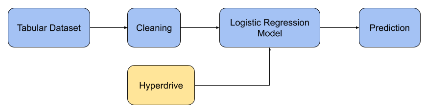

# Optimizing an ML Pipeline in Azure

### Lucas Oliveira

## Overview
This project is part of the Udacity Azure ML Nanodegree.
In this project, we build and optimize an Azure ML pipeline using the Python SDK and a provided Scikit-learn model.
This model is then compared to an Azure AutoML run.

## Summary

The data is related with direct marketing campaigns of a Portuguese banking institution [1].

The classification goal is to predict if the client will subscribe (yes/no) a term deposit (variable y) [1].

The best performing model as a VotingEnsemble, which achieved an accuracy of **0.9173**.

## Scikit-learn Pipeline
The first model trained was a logistic regression model. In the image below we illustrate the pipeline used for training:

It first loads the dataset, clean it and then feed into the model for training. The model run several iterations driven by Azure Hyperdrive in order to find the hyperparameters that maximize the model's accuracy.

The hyperparameters tuned were the **Inverse of regularization strength** and the **Maximum number of iterations to converge**. 

The parameter sampler used was the random sampling. In random sampling, hyperparameter values are randomly selected from the defined search space [2]. The advantages of using random sampling are that it supports discrete and continuous hyperparameters [2] and also can cover a broad range of hyperparameters values in a short period of time. Some users do an initial search with random sampling and then refine the search space to improve results [2].

The early stopping chosen was the bandit policy. Bandit policy is based on slack factor/slack amount and evaluation interval. Bandit ends runs when the primary metric isn't within the specified slack factor/slack amount of the most successful run [3]. The advantage of this method is that it will prevent the experiment to stay trying to optimize runs with hyperparameters that doesn't seem promising to get good results. 

The final accuracy result of the LogisticRegression model was **0.9139**.

## AutoML
The second model trained was a VotingEnsemble. It was select as the best model after 25 iterations using Azure AutoML for model searching. In the image below we show the pipeline used for training:

Here it justs loads the data and give it to the AutoML search for models and hyperparameters that maximize the model's accuracy.

The final accuracy result of the VotingEnsemble model found by AutoML was **0.9173**.

## Pipeline comparison
The accuracy of the two models were very similar, with a small advantage to the model found using Azure AutoML. The architecure of the AutoML setup was also much simpler since it did not required us to clean the data, choose a model and select search parameters. AutoML does all of this automatically giving a very similar result, however this come with the cost of more computing time.

## Future work
In order to improve our model search we can do a few things:
- Let AutoML and Hyperdrive run for longer period of times so they can search for better models;
- Use hyperdrive to try to find optimal parameters for other machine learning models;
- Try to optimize for different metrics to try to find better models

## References:
1. https://archive.ics.uci.edu/ml/datasets/bank+marketing
2. https://docs.microsoft.com/en-us/azure/machine-learning/how-to-tune-hyperparameters#random-sampling
3. https://docs.microsoft.com/en-us/azure/machine-learning/how-to-tune-hyperparameters#bandit-policy
